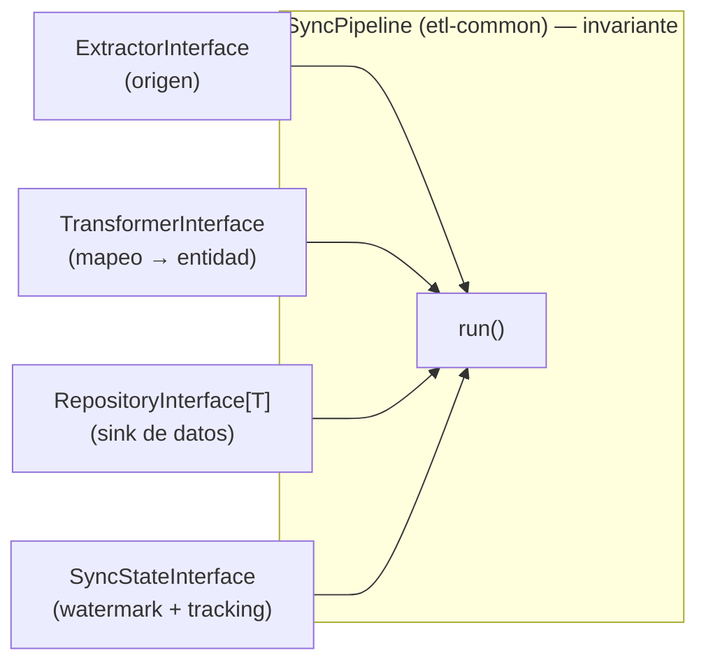
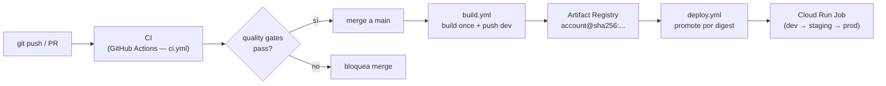

# Arquitectura

## Propósito y alcance

`datalake-platform` sincroniza datos desde sistemas de origen hacia un data lake
analítico. El alcance actual es **Odoo → BigQuery**, pero la arquitectura es
agnóstica del origen y del destino por diseño: la combinación `Odoo → Snowflake`
o `SAP → BigQuery` no altera el proceso de orquestación, únicamente los
adaptadores concretos que se inyectan.

La finalidad última es **Business Intelligence**: los datos aterrizan en una capa
cruda inmutable y se publican en una capa servida lista para que cualquier
analista se conecte desde una herramienta de BI (Metabase u otra). Ver
[`data-model.md`](data-model.md).

## Estructura del monorepo

El repositorio es un **workspace de uv** con dos categorías de miembros:

| Directorio | Rol | Naturaleza |
|---|---|---|
| `packages/common` (`etl-common`) | Contratos, infraestructura y pipeline genérico | Librería (se importa) |
| `jobs/account` (`etl-account`) | ETL de `account.move` | Unidad desplegable (un Cloud Run Job) |

La separación `packages/` vs `jobs/` comunica la intención: las librerías se
reutilizan, los jobs se despliegan. Cada job declara `etl-common` como
dependencia de workspace (resolución por path local, sin registry privado) y se
empaqueta en su propia imagen.

Ambos paquetes usan **src layout**: el código solo es importable cuando el
paquete está instalado (`uv sync`), de modo que los tests y el contenedor
ejercitan el paquete instalado, no archivos sueltos en el `PYTHONPATH`.

## El pipeline agnóstico: composición sobre herencia

La orquestación vive **una sola vez** en `etl-common`, en un `SyncPipeline`
genérico. El proceso (obtener watermark → leer IDs nuevos → procesar por lotes →
checkpoint → finalizar) es invariante. Lo único que varía entre combinaciones
origen/destino son los **adaptadores**, que se inyectan por composición.



Se eligió **composición** y no Template Method porque la variación es de
*colaboradores* (qué adaptador), no de *comportamiento*. Cuando lo único que
cambia es la pieza inyectada, la herencia no aporta y acopla cada módulo a una
clase base. Los detalles privados de cada adaptador (por ejemplo, el prefetch de
impuestos del extractor de Odoo) se encapsulan en métodos privados del propio
adaptador, detrás del contrato del port.

### Los cuatro ports

Todos los contratos viven en `etl_common.interfaces`, completamente tipados:

| Port | Responsabilidad | Implementación actual |
|---|---|---|
| `ExtractorInterface` | Leer IDs nuevos y lotes desde el origen | Odoo (XML-RPC) |
| `TransformerInterface` | Mapear el registro crudo a una **entidad de dominio** | `account.move` |
| `RepositoryInterface[T]` | Persistir entidades en el sink (append) | BigQuery |
| `SyncStateInterface` | Plano de control: watermark + metadata de cada corrida | BigQuery |

Para agregar un destino (Snowflake) o un origen (SAP), se escriben adaptadores
nuevos que implementan estos contratos. El `SyncPipeline` permanece inalterado.

> **Nota de diseño.** El watermark y el tracking se modelan como un port
> (`SyncStateInterface`) en lugar de quedar acoplados a la conexión de BigQuery,
> porque el plano de control pertenece al destino. Si el sink es Snowflake, el
> watermark y la metadata residen en Snowflake.

## Arquitectura limpia dentro de cada módulo

Cada job separa el dominio de su persistencia:

```
jobs/account/src/account/
├── domain/                  # entidades puras — cero frameworks (stdlib dataclass)
│   ├── account_move.py      # aggregate root: contiene sus líneas
│   └── account_move_line.py
└── persistence/
    ├── models/              # ORM SQLAlchemy = esquema del sink (BigQuery)
    └── repositories/        # mapea entidad ↔ ORM y persiste
```

**Regla de dependencia:** `domain` no importa nada; `persistence` depende de
`domain`; nunca a la inversa. La entidad de dominio no conoce SQLAlchemy, BigQuery
ni ningún detalle de almacenamiento. Esa es la condición que permite cambiar de
sink sin tocar ni la entidad ni el transformer.

Las entidades se modelan como `@dataclass` de la librería estándar y no con
Pydantic: el dominio no debe conocer ningún framework, y Pydantic también lo es.

## Modelo de datos: medallion

El motor sigue el patrón **medallion** (Bronze → Silver → Gold) y produce las dos
primeras capas. Por cada entidad de dominio se materializan **dos tablas** en
BigQuery:

1. **Bronze** — append inmutable. Registra cada sincronización con metadata de
   ingesta (`synced_at`, `sync_batch_id`). Conserva el historial completo y permite
   recrear las capas superiores sin releer el origen.
2. **Silver** — datos limpios y deduplicados, una fila por entidad (la versión más
   reciente), materializada para consumo analítico.

**Gold** (star schemas, data marts) es modelado downstream y opcional; no lo
produce este motor. El detalle del modelo, la consulta de deduplicación y el
consumo desde Metabase están en [`data-model.md`](data-model.md).

## Semántica de carga y resiliencia

La carga es **append**, no upsert. La capa cruda es un log inmutable de lo que el
origen reportó y cuándo. La deduplicación a "estado actual" es una operación de
lectura, materializada en la capa servida.

Esta decisión, combinada con el checkpoint, otorga semántica **effectively-once**:

- **Append tolera el reprocesamiento.** Si una corrida se interrumpe y se reanuda,
  los lotes ya procesados se vuelven a insertar como **versiones** adicionales, no
  como corrupción. La capa servida toma la última versión por `id`.
- **Checkpoint por lote, posterior al commit de datos.** El watermark avanza
  después de persistir cada lote. Si ocurre un fallo entre el commit de datos y el
  checkpoint, el próximo run reprocesa ese lote sin consecuencias.
- **El watermark es una optimización**, no un mecanismo de corrección: evita
  releer el origen. Si queda atrasado, el peor caso es reprocesar.

## Observabilidad — backend configurable

La observabilidad sigue el mismo patrón ports-and-adapters que el resto del motor.
El código de aplicación no conoce el backend de logging; solo conoce el contrato.

| Símbolo | Rol |
|---|---|
| `LogBackend` (Protocol) | Contrato del port — cualquier backend lo cumple |
| `GcpLogBackend` | Adaptador: JSON de una línea, compatible con Cloud Logging |
| `ConsoleLogBackend` | Adaptador: salida legible para desarrollo local |
| `configure_logging(backend)` | Registra el backend activo; idempotente |
| `resolve_backend(name)` | Convierte el string del env var (`"gcp"` / `"console"`) en instancia |
| `get_logger(name)` | Punto de acceso universal; todo el código lo usa |

Todo el código de la aplicación importa exclusivamente desde el paquete raíz:

```python
from etl_common.observability import get_logger
```

Nunca desde módulos de backend específicos. El backend activo se determina en el
composition root (`__main__.py`) antes de construir cualquier adaptador:

```python
from etl_common.observability import configure_logging, resolve_backend

settings = Settings()
configure_logging(resolve_backend(settings.LOG_BACKEND))
```

La variable `LOG_BACKEND` acepta `"gcp"` (default) o `"console"`. En producción
(Cloud Run) el backend GCP emite JSON estructurado compatible con Cloud Logging.
En desarrollo local se usa `console` para salida legible.

## Propiedad de la infraestructura

El motor aplica una separación estricta entre lo que crea el IaC y lo que crea la
aplicación:

| Recurso | Propietario | Mecanismo |
|---|---|---|
| Datasets de BigQuery | IaC | Terraform / IaC — la app nunca llama `create_dataset` |
| Tablas de BigQuery | Aplicación | `BigQueryConnection.create_tables()` — único punto DDL |

`BigQueryConnection` recibe los nombres reales de los datasets como parámetros
(`raw_dataset`, `control_dataset`) y los registra en SQLAlchemy mediante
`schema_translate_map`. Los modelos ORM usan tokens simbólicos en `__table_args__`:

```python
class AccountMoveORM(Base):
    __table_args__ = {"schema": "raw", ...}   # "raw" → resuelve a BQ_DATASET_RAW

class SyncMetadata(Base):
    __table_args__ = {"schema": "control", ...}  # "control" → resuelve a BQ_DATASET_CONTROL
```

En tiempo de ejecución, SQLAlchemy sustituye el token por el nombre real del
dataset. Esto desacopla los modelos ORM de los nombres de infraestructura: el mismo
código funciona en cualquier entorno con solo cambiar las variables de entorno.

**Principio:** la aplicación no crea nada que no le pertenezca. Los datasets son
provistos por el IaC antes del primer deploy; la app asume que existen y solo
materializa sus propias tablas.

## Despliegue



- **Imagen distroless** (multi-stage): el builder usa `python:3.11-slim` + `uv`
  para construir el entorno; el runtime es `gcr.io/distroless/cc-debian12` con un
  intérprete Python gestionado por `uv`. Sin shell ni herramientas: solo lo
  necesario para ejecutar el job. Ver el `Dockerfile` de cada job.
- **Tag por digest inmutable** para trazabilidad y rollback determinístico.
- **Contexto de build = raíz del repositorio**, porque la imagen necesita copiar
  tanto `packages/common` como el job.
- `build.yml` y `deploy.yml` viven en **este** repositorio (tienen el código y el
  Dockerfile); autentican a GCP por Workload Identity Federation y deployan vía
  `gcloud run jobs update` (pipeline-driven). Ver [`ops/ci-cd.md`](../ops/ci-cd.md).
- La **infraestructura como código** (Cloud Run Jobs, scheduler, datasets,
  Artifact Registry, identidad de deploy) vive en un repositorio de
  infraestructura separado.

## Estado de implementación

| Componente | Estado |
|---|---|
| Workspace uv, src layout, empaquetado | Implementado |
| Entidades de dominio + separación `domain/` / `persistence/` | Implementado |
| Cuatro ports tipados (`Extractor`, `Transformer`, `Repository[T]`, `SyncState`) | Implementado |
| `SyncPipeline[T]` genérico (composición) | Implementado |
| Capa Bronze: `BigQueryAccountMoveRepository` (append) | Implementado |
| `BigQuerySyncState` (watermark + plano de control) | Implementado |
| Composition root (`__main__.py`) con wiring completo | Implementado |
| Observabilidad: `LogBackend` Protocol + `GcpLogBackend` / `ConsoleLogBackend` | Implementado |
| Datasets env-driven via `schema_translate_map` (tokens ORM → nombres reales) | Implementado |
| Build distroless (multi-stage, `.dockerignore` strips dev) | Implementado |
| CI: quality gates en GitHub Actions (`ci.yml`) | Implementado |
| Release: `cz bump` + changelog (`release.yml`) | Implementado |
| `build.yml` / `deploy.yml` (build once, promote por digest, WIF) | Implementado |
| Capa Silver (deduplicación, `BQ_DATASET_SILVER`, materializador) | Diseñado, pendiente |
